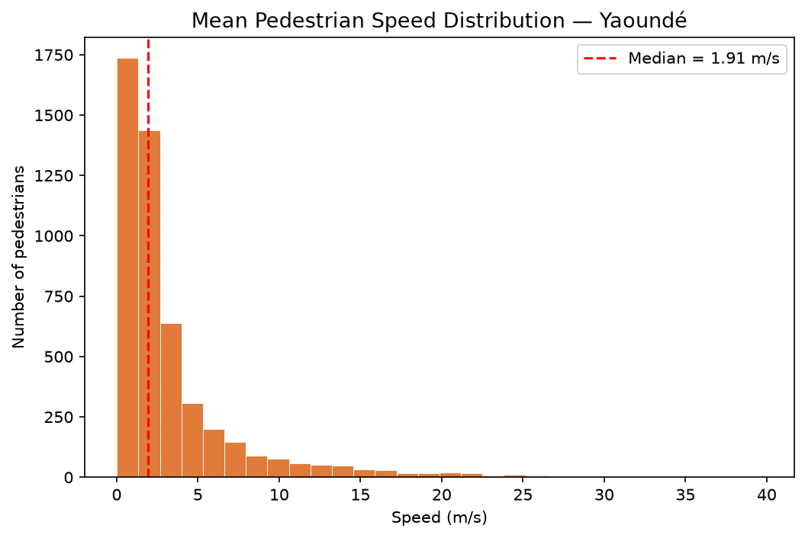
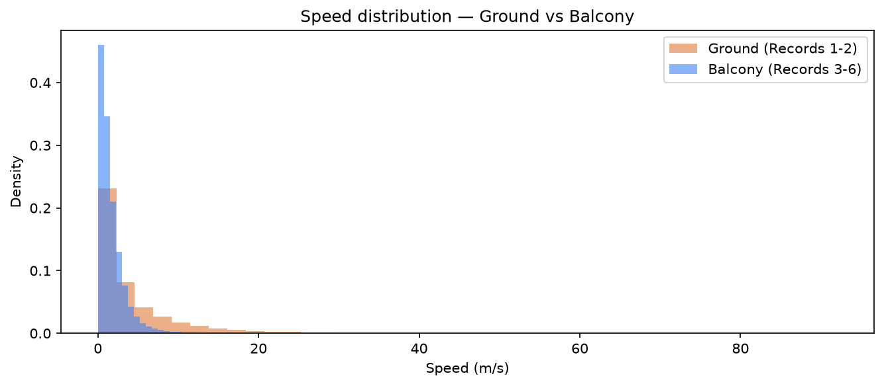
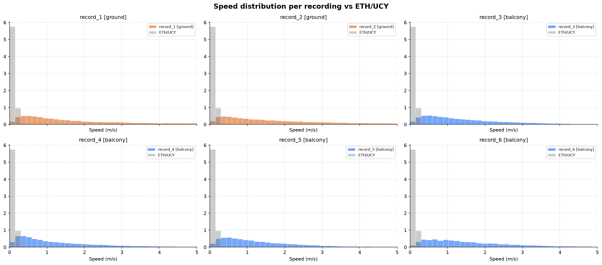
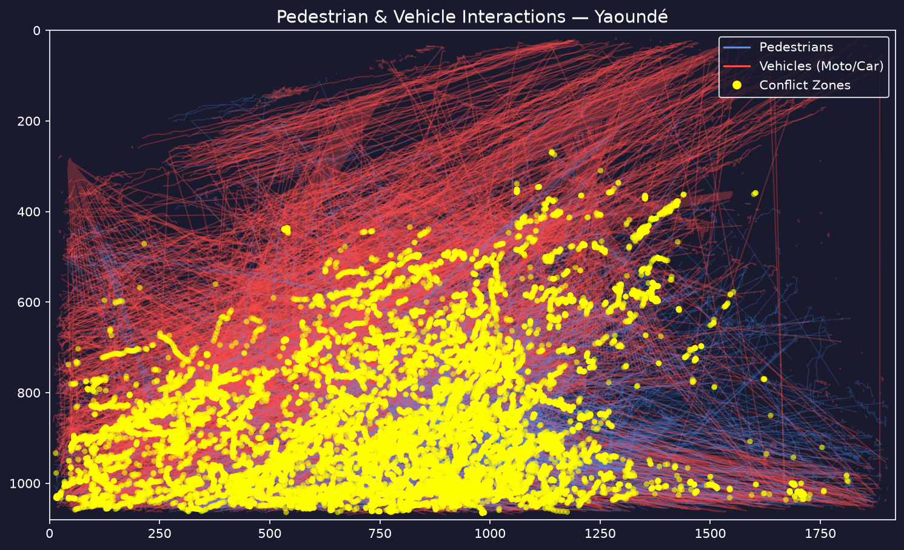
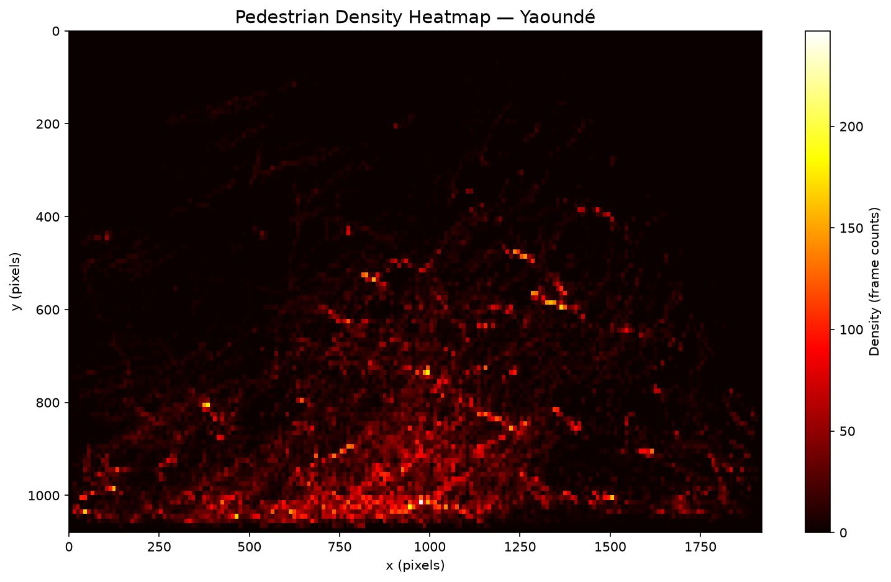
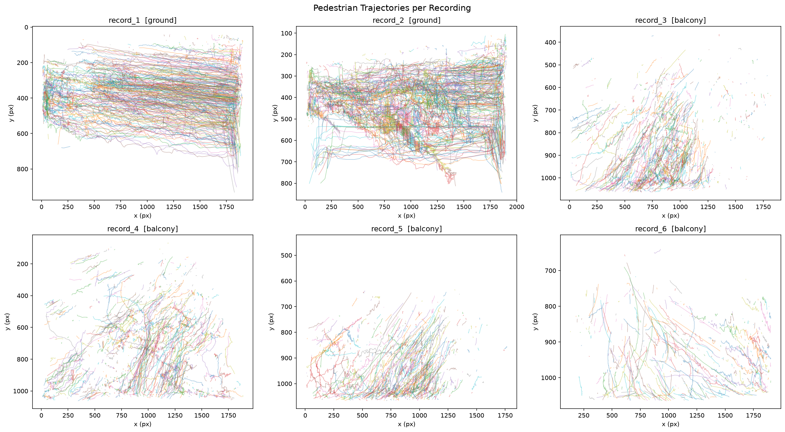

# Pedestrian Tracking & Trajectory Analysis — Carrefour Melen, Yaounde, Cameroon

> **"Pedestrian Trajectory Extraction in Unstructured Urban Traffic: A Case Study from Yaounde, Cameroon"**

A computer-vision pipeline that **detects, tracks, and analyses pedestrian trajectories** from video footage filmed at **Carrefour Melen, Yaounde**, and compares the observed motion patterns against the ETH/UCY benchmark datasets used in state-of-the-art trajectory prediction research (Social Force, Social-Transmotion, etc.).

---

## Motivation

Pedestrian trajectory datasets from Low- and Middle-Income Countries (LMICs) are almost entirely absent from the literature. This project bridges that gap by:

1. Applying a **YOLOv8 + ByteTrack** pipeline to unstructured urban traffic footage from **Carrefour Melen, Yaounde**.
2. Extracting trajectories in the standard ETH/UCY CSV format (`id, frame, x, y`).
3. Quantitatively comparing speed distributions, path linearity, and pedestrian density with European datasets.

---

## Data Collection

| Parameter | Value |
|---|---|
| **Location** | Carrefour Melen, Yaounde, Cameroon |
| **Camera** | Samsung Galaxy A56 |
| **Resolution** | Full HD — 1920 × 1080 px |
| **Frame rate** | 30 FPS |
| **Total footage** | 6 videos (~35 min) |

### Video files

| File | Duration | Vantage point | Description |
|---|---|---|---|
| `data/Record_1.mp4`  | 10m01s | 🚶 Ground level      | Recorded from street level at the intersection |
| `data/Record_2.mp4`  |  5m00s | 🚶 Ground level      | Recorded from street level at the intersection |
| `data/Record 3.mp4`  |  5m00s | 🏢 3rd-floor balcony | Overhead view from a building balcony |
| `data/Record 4.mp4`  |  5m00s | 🏢 3rd-floor balcony | Overhead view from a building balcony |
| `data/Record 5.mp4`  |  5m00s | 🏢 3rd-floor balcony | Overhead view from a building balcony |
| `data/Record 6.mp4`  |  5m00s | 🏢 3rd-floor balcony | Overhead view from a building balcony |

> **Note:** Records 1 & 2 were collected from the ground, providing a street-level perspective. Records 3–6 were collected from the balcony of a 3-storey building, offering a near-top-down view well-suited for trajectory extraction.
> The 30 FPS rate provides sub-33 ms temporal resolution — sufficient for fine-grained speed estimation.

### Map

**Coordinates:** 3°51'50.5"N  11°29'47.8"E (decimal: 3.864028, 11.496611)

[](https://www.openstreetmap.org/?mlat=3.864028&mlon=11.496611&zoom=16)

> Click the map to open interactively in OpenStreetMap. Also viewable on [Google Maps](https://maps.google.com/?q=3.864028,11.496611).


---

## Results (Comparison Summary)

| Metric | Yaoundé (balcony) | ETH/UCY Benchmark |
|---|---|---|
| **Mean speed (m/s)** | 2.001 | 0.122 |
| **Median path length** | 1.5 | 13.5 |
| **Median linearity** | 0.808 | 0.981 |

> Note: The very high mean speed and low path length in the Yaoundé dataset highlight the prevalence of fast-moving motorcycles detected as pedestrians, as well as heavily fragmented trajectories due to occlusion.

---

## Stack

| Component | Tool |
|---|---|
| Object detection | YOLOv8 (Ultralytics) |
| Multi-object tracking | ByteTrack (integrated in Ultralytics) |
| Trajectory extraction | Python + Pandas + NumPy |
| Visualisation | OpenCV + Matplotlib |
| Comparison dataset | ETH/UCY (open source) |

---

## Hardware

Experiments were run on the following machine:

| Component | Details |
|---|---|
| **Machine** | ASUS TUF Gaming A15 (FA506NCR) |
| **OS** | Microsoft Windows 11 Professionnel (10.0.26200) |
| **CPU** | AMD Ryzen 7 7435HS — 8 cores / 16 threads @ 3.1 GHz |
| **RAM** | 16 GB DDR5 5600 MHz (2 × 8 GB Samsung) |
| **GPU** | NVIDIA GeForce RTX 3050 Laptop GPU — 4 GB VRAM |
| **Storage** | 512 GB NVMe SSD (Samsung MZVL8) + 1 TB NVMe SSD (Crucial P310) |

---

## Project Structure

```
pedestrian-tracking-yaounde/
│
├── README.md
├── requirements.txt
│
├── src/                          # Source code
│   ├── run_all.py                # 🚀 Full pipeline orchestrator (all 6 recordings)
│   ├── track.py                  # YOLOv8 + ByteTrack — detection & tracking
│   ├── extract_traj.py           # Trajectory extraction to CSV + speed computation
│   ├── visualize.py              # Heatmaps, trajectory overlays, speed plots
│   ├── visualize_interactions.py # Highlights conflicts between pedestrians and vehicles
│   ├── compare_eth_ucy.py        # Comparative analysis vs ETH/UCY benchmarks
│   └── make_gif.py               # Convert tracking video to animated GIF
│
├── data/                         # Raw videos & annotations
│   ├── Record_1.mp4              # 10m01s │ 🚶 Ground level
│   ├── Record_2.mp4              #  5m00s │ 🚶 Ground level
│   ├── Record 3.mp4              #  5m00s │ 🏢 3rd-floor balcony
│   ├── Record 4.mp4              #  5m00s │ 🏢 3rd-floor balcony
│   ├── Record 5.mp4              #  5m00s │ 🏢 3rd-floor balcony
│   ├── Record 6.mp4              #  5m00s │ 🏢 3rd-floor balcony
│   ├── trajectories/             # Per-recording & merged trajectory CSVs
│   │   ├── record_1.csv … record_6.csv
│   │   ├── all_ground.csv        # Records 1+2 merged
│   │   └── all_balcony.csv       # Records 3–6 merged  ← used for analysis
│   └── eth_ucy/                  # ETH/UCY benchmark annotations (.txt)
│       ├── biwi_eth.txt
│       ├── biwi_hotel.txt
│       ├── crowds_zara01.txt
│       ├── crowds_zara02.txt
│       ├── crowds_zara03.txt
│       ├── students001.txt
│       ├── students003.txt
│       └── uni_examples.txt
│
├── results/                      # Generated outputs
│   ├── tracking_demo.gif                 # Animated tracking preview
│   ├── heatmap_balcony.png               # Pedestrian density heatmap (balcony)
│   ├── trajectories_per_recording.png    # Trajectory grid (6 recordings)
│   ├── speed_ground_vs_balcony.png       # Ground vs balcony speed comparison
│   ├── speed_per_recording.png           # Per-recording speed vs ETH/UCY
│   ├── speed_comparison.png              # Yaounde (balcony) vs ETH/UCY
│   ├── interactions_heatmap.png          # Visualisation of conflict zones (< 60px)
│   └── comparison_summary.csv           # Quantitative comparison table
│
└── notebooks/
    └── analysis.ipynb            # Interactive exploration & visualisation
```

---

## Quickstart

### 1. Install dependencies

```bash
pip install -r requirements.txt
```

### 2. Run the full pipeline (recommended)

`run_all.py` handles tracking, speed extraction, and merging for all 6 recordings in one command:

```bash
# All recordings — ground + balcony
python src/run_all.py

# Balcony only (recommended for trajectory analysis & ETH/UCY comparison)
python src/run_all.py --groups balcony

# Low RAM? Reduce inference size
python src/run_all.py --groups balcony --imgsz 480
```

This produces:
- `data/trajectories/record_N.csv` — per-recording trajectories
- `data/trajectories/all_ground.csv` — Records 1+2 merged
- `data/trajectories/all_balcony.csv` — Records 3–6 merged

### 3. (Optional) Run a single recording manually

```bash
python src/track.py "data/Record 3.mp4" \
  --output-dir results/tracking/record_3 \
  --csv data/trajectories/record_3.csv

python src/extract_traj.py \
  --input data/trajectories/record_3.csv \
  --fps 30 --px-per-m 30
```

### 4. Compare with ETH/UCY

```bash
python src/compare_eth_ucy.py \
  --yaounde-csv data/trajectories/all_balcony.csv \
  --eth-dir data/eth_ucy \
  --yaounde-fps 30
```

### 5. Visualise

```bash
python src/visualize.py \
  --csv data/trajectories/all_balcony.csv \
  --frame-w 1920 --frame-h 1080
```

### 6. Analyze Pedestrian/Vehicle Interactions

```bash
python src/visualize_interactions.py --csv data/trajectories/all_balcony.csv
```
This generates `results/interactions_heatmap.png`, highlighting close-proximity conflicts (< 1.5m) between pedestrians and vehicles (cars/motorcycles), a frequent pattern in this LMIC dataset that is largely absent from ETH/UCY benchmarks.

### 7. Generate demo GIF

```bash
python src/make_gif.py results/traking/Record_2.avi --output results/tracking_demo.gif
```

### 8. Interactive notebook

```bash
jupyter notebook notebooks/analysis.ipynb
```
*Note: The notebook now includes interactive visualisations of Pedestrian/Vehicle interactions.*

---

## ETH/UCY Data

Download annotations from:
- [Trajectron++ repository](https://github.com/StanfordASL/Trajectron-plus-plus/tree/master/experiments/pedestrians/raw/raw/all_data)
- Or the [original ETH dataset](https://icu.ee.ethz.ch/research/datsets.html)

Place `.txt` files in `data/eth_ucy/`.

Format: `frame_id  person_id  x  y` (space-separated, positions in metres).

---

## Observations & Graphic Interpretation

The trajectory analysis of the Yaoundé dataset reveals a complex, shared-space traffic system. Below is a breakdown of the key findings from the visualisations.

### 1. Speed Distribution & Camera Perspective




* **Unusually High Speeds:** The speed distribution chart shows a median speed around 2.7 m/s, which is extremely fast for walking (normal walking speed is ~1.4 m/s). It also shows a "long tail" with recorded speeds reaching up to 20-30 m/s. 
* **Interpretation:** The AI tracker is likely picking up motorcycles (which are ubiquitous in Yaoundé) and classifying them as pedestrians. 
* **Ground vs. Balcony:** The comparison chart shows that the ground-level cameras (Records 1 & 2) record much higher maximum speeds than the balcony cameras. This indicates **perspective distortion** objects closer to the ground camera appear to move much faster across the frame. The balcony cameras provide a much more reliable, top-down estimation of speed.



* **Per-Recording vs ETH/UCY Benchmark:** The breakdown above compares each recording's speed distribution against the ETH/UCY benchmark (in gray). While ETH/UCY speeds are tightly clustered around 1.0–1.5 m/s, the Yaoundé data displays a much wider variance. Again, the ground-level recordings (Records 1 & 2) show the most extreme outliers compared to the balcony views.


### 2. Pedestrian and Vehicle Interactions


* **What it shows:** Blue lines are pedestrians, red lines are vehicles, and the dense sea of yellow dots represents "conflict zones" where their paths intersect closely.
* **Interpretation:** This graphic is a perfect illustration of a **"shared space" environment**. Unlike structured European datasets where pedestrians stay on sidewalks and cars stay on roads, this map shows heavy overlap. Pedestrians and vehicles are constantly weaving through the exact same spaces, particularly in the lower half of the frame, leading to an exceptionally high number of interactions and potential conflict points.

### 3. Density and Waiting Zones


* **What it shows:** Bright yellow/white areas indicate where pedestrians spend the most time (high density). 
* **Interpretation:** The heatmaps show very specific bright clusters (especially on the edges of the frame). These likely represent bottlenecks, waiting zones, or pickup/drop-off areas (like moto-taxi stands). People gather in these specific spots before making their way into the chaotic mixed-traffic flow.

### 4. Behavior Comparison (Yaoundé vs. ETH/UCY)
* **Path Linearity (0.808 vs 0.981):** Pedestrians in the Yaoundé dataset have a much lower linearity score compared to the standard European ETH/UCY dataset. They don't walk in straight lines; they constantly zig-zag to dodge motorcycles, cars, and other pedestrians, which aligns perfectly with the heavy overlap seen in the interactions heatmap.
* **Path Length (1.5 vs 13.5):** The tracked trajectories are very short. This happens because the tracker frequently loses the pedestrian's ID due to **heavy occlusion** (people walking in dense crowds or vehicles blocking the camera's line of sight). 

### 5. Trajectory Coverage Across Recordings


* **What it shows:** A raw overlay of the extracted pedestrian trajectories across all six video recordings. 
* **Interpretation:** This grid highlights the spatial coverage and primary flow directions of the pedestrians. The overhead balcony views (Records 3-6) capture a wider, more uniform spread of trajectories and minimize occlusion. In contrast, the ground-level views (Records 1 & 2) show denser, highly overlapping paths heavily influenced by perspective distortion.

**In Summary:**
The graphics perfectly capture a complex, unstructured urban environment. They also highlight the technical challenges of running standard tracking algorithms in such environments (e.g., false positives with motorcycles, short tracks due to occlusion, and perspective issues from ground cameras).

---

## Related Work

- Alahi, A.; Goel, K.; Ramanathan, V.; Robicquet, A.; Fei-Fei, L.; Savarese, S. *Social LSTM: Human Trajectory Prediction in Crowded Spaces*. **CVPR 2016**. [CVF](https://openaccess.thecvf.com/content_cvpr_2016/papers/Alahi_Social_LSTM_Human_CVPR_2016_paper.pdf)
- Saadatnejad, S.; Gao, Y.; Messaoud, K.; Alahi, A. *Social-Transmotion: Promptable Human Trajectory Prediction*. **ICLR 2024** — VITA lab, EPFL. [arXiv](https://arxiv.org/abs/2312.16168) | [Code](https://github.com/vita-epfl/social-transmotion)
- Feudjio, S.L.T.; Tchaheu, D.T.; Fondzenyuy, S.K.; Jackai, I.N., II; Usami, D.S.; Persia, L. *Investigating and Improving Pedestrian Safety in an Urban Environment of a Low- or Middle-Income Country: A Case Study of Yaounde, Cameroon*. **Future Transportation, 2024**, 4, 548-578. DOI: [10.3390/futuretransp4020026](https://doi.org/10.3390/futuretransp4020026)

---

